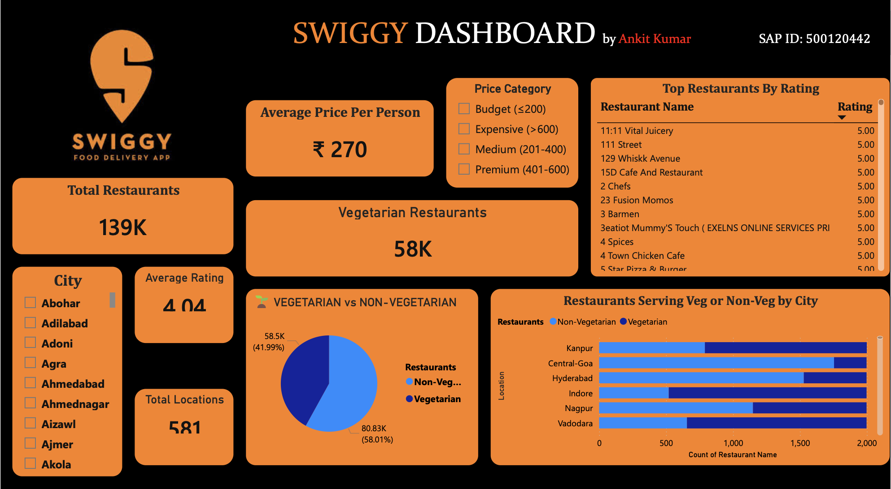

# 🍔 Swiggy Sales & Performance Dashboard

## 📌 Project Overview
This project provides a comprehensive Power BI dashboard to analyze Swiggy's sales, delivery performance, and overall business metrics. It is designed to help stakeholders identify key trends, evaluate operational efficiency, and make data-driven decisions to enhance customer satisfaction and revenue growth.

## 🚀 Key Features
* **Sales Analysis:** Track total revenue, order volume, and average order value.
* **Delivery Performance:** Analyze delivery times, delays, and peak order hours.
* **Customer Insights:** Identify top-performing restaurants and popular cuisines.
* **Geographical Trends:** Visualize high-demand areas and regional performance.
* **Interactive Visualizations:** Drill-down capabilities for deeper data exploration.

## 📂 Dataset
The analysis is based on a cleaned dataset containing historical Swiggy order records.
* **File:** `swiggy_cleaned_for_powerbi.csv`
* **Contents:** Order details, delivery times, restaurant ratings, costs, and customer demographics.

## 📸 Dashboard Preview

## 🛠️ Tools Used
* **Power BI:** Data visualization, DAX modeling, and interactive dashboard creation.
* **CSV:** Raw data storage and extraction format.

## 💡 Insights & Suggestions
* **Peak Hours:** A significant volume of orders is concentrated during lunch and dinner times.
* **Delivery Efficiency:** Average delivery times vary notably across different zones, indicating a need for localized logistics optimization.
* **Revenue Drivers:** A small percentage of top-rated restaurants contribute disproportionately to the total revenue.

## ⚙️ How to Use
1. **Prerequisites:** Ensure you have [Power BI Desktop](https://powerbi.microsoft.com/desktop/) installed on your machine.
2. **Download the Repository:** Clone or download this repository to your local system.
3. **Open the Dashboard:** Double-click on the `Swiggy_Dashboard_Ankit.pbix` file to open it in Power BI.
4. **Explore the Data:** Interact with the dashboard visuals, slicers, and filters to explore different metrics.
*(Note: If the data source needs updating, reconnect it to the `swiggy_cleaned_for_powerbi.csv` file within Power BI's Data Source Settings).*

---
## 👨‍💻 Author
**Name:** Ankit Kumar  
**College:** UPES  
**SAP ID:** [Leave Placeholder / Add your SAP ID here]  

*Feel free to connect or reach out for any questions regarding this project!*
